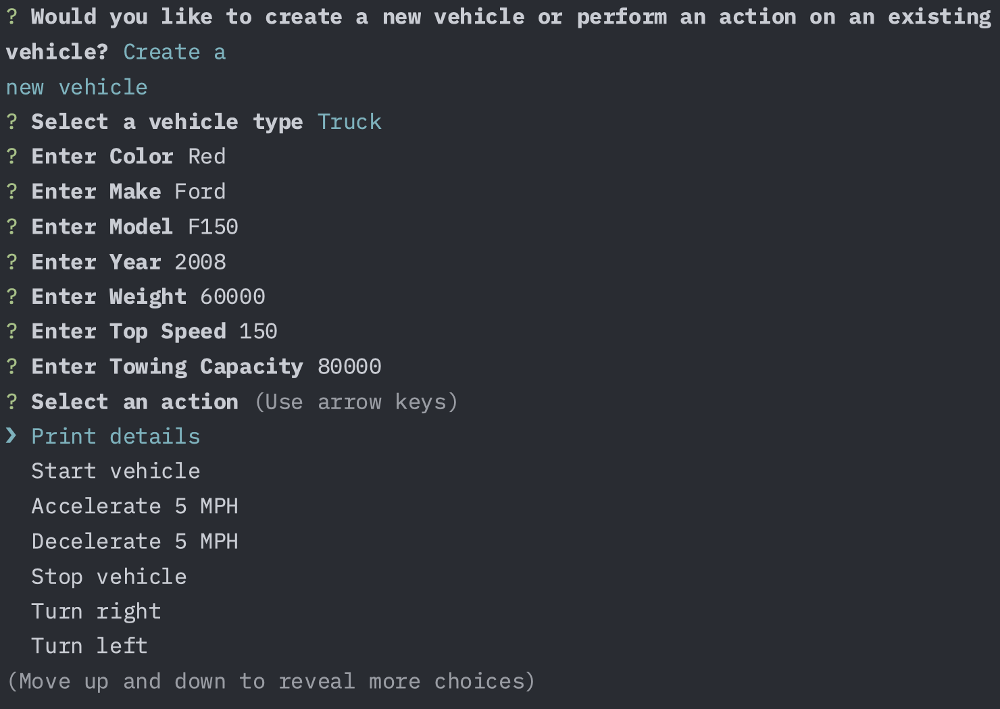

# Vehicle Builder

## Table of Contents
- [Description](#description)
- [Installation](#installation)
- [Usage](#usage)
- [Contributing](#contributing)
- [License](#license)
- [Tests](#tests)
- [Questions](#questions)

## Description
An application that walks through the steps taking user prompts on making a vehicle. It wouldn't matter if it was a Car, Truck, or Motorbike. The correct information would be passed about the vehicle and properly presented back to the user.

## Installation
Download the source code to your local machine

## Usage
Run 'npm install', then run 'npm start'

## Contributing
Submit a Pull Request on Github

## Tests
https://drive.google.com/file/d/1L-nvsmtAt-bQIWLLRr3hVj0GmL5ByZsg/view?usp=drive_link

## License

This project is licensed under the MIT.
[MIT License](https://opensource.org/licenses/MIT)

## Questions
If you have any questions, please feel free to reach out:

- GitHub: [lattecoding](https://github.com/lattecoding)
